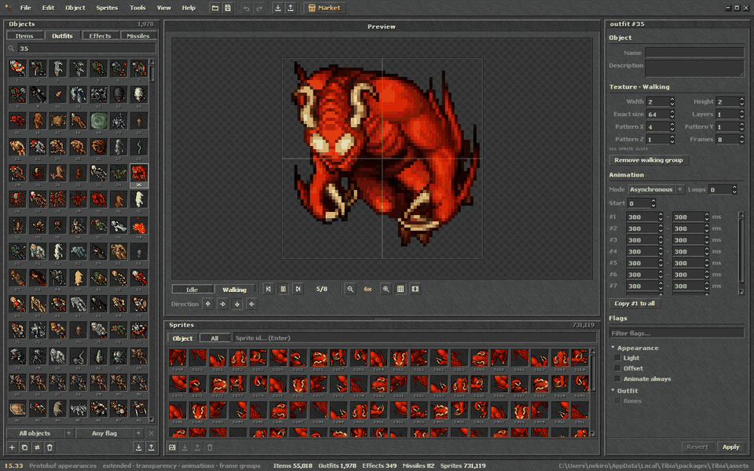

<div align="center">


# OTS Creator

**Object editor for Open Tibia clients, from `Tibia.dat` / `Tibia.spr` to Tibia 12+ assets.**

[](https://github.com/nekiro/ots-creator/releases/latest)
[](https://github.com/nekiro/ots-creator/releases)

[](LICENSE)

[Download](https://github.com/nekiro/ots-creator/releases/latest) ·
[Features](#features) ·
[OTOBJ format](#otobj-object-format) ·
[Development](#development)

</div>

It looks and feels like the Tibia client, and it has a built-in market to share objects
and sprites with other users. Built with [Wails v3](https://v3.wails.io) (Go) and Svelte 5.



## Features

**Clients**

- Open and compile `Tibia.dat` / `Tibia.spr` for every client version. The version is
  detected from the file signatures, and OTFI files are supported. Extended sprites,
  transparency, improved animations and frame groups are all handled.
- Tibia 12+ assets: `catalog-content.json`, `appearances.dat` (protobuf) and LZMA sprite
  sheets, including object names and descriptions. Files are written back byte for byte
  when nothing changed.
- Create new clients, and convert between versions and between dat/spr and assets
  ("compile as"). Flags the target version cannot store are reported as warnings.

**Editing**

- Object list with categories (items, outfits, effects, missiles), search by id or name,
  and filters by flag.
- Live preview: animation, directions, idle and walking groups, addons, mounts, outfit
  colors, zoom and pixel grid.
- Properties editor for layout, patterns, frame durations and every flag, with a flag
  filter.
- Sprite list per object or for the whole client, with multi-select, replace, import and
  export. Draw on sprites in the sprite view, with a pixel grid, zoom and pan.
- Undo/redo, copy and paste of whole objects or only their properties, bulk edit of
  several objects, and duplicate and remove.

**Import and export**

- Objects as `.otobj`, the native format (see [OTOBJ](#otobj-object-format) below), or as
  OBD (ObjectBuilder): import of OBD versions 1 to 3, export as version 3. Settings choose
  the export format. An object viewer shows both without an open client.
- Export all objects (one folder per category) or all sprites (single files or sprite
  sheets) at once. Exports run in the background (see [Performance](#performance)).
- Sprite sheets: export one frame group or the whole outfit. On import the layout is
  detected from the image (directions, mask layer, mounts, addons, frames).
- Drop images, `.otobj` or `.obd` files anywhere, onto the preview or onto an object in the list, or
  paste a PNG with Ctrl+V.
- Slicer to cut images into sprites.

**Compare and merge clients**

- Open a second client next to the current one and compare them category by category.
  Sprites are compared by their pixels, not by their ids, and differences that only come
  from the client formats are ignored.
- Every difference shows both versions side by side, animated on hover, with what changed
  (flags, size, patterns, frames, animation, sprites). An empty placeholder against a real
  object counts as a new object, and a filter hides ids that are empty in the only client
  that has them.
- Copy objects in both directions, keeping their ids or appending them as new objects,
  or merge everything B has into A at once. A sprite with the same pixels under the same
  id in the target is reused instead of added again.
- Every copy is one undo step in its target client. Copies that kept their ids can also
  be reverted one by one from the list. The second client can be compiled from the
  same window.

**Tools**

- Optimize sprites (duplicates, empty and unused ones), bulk frame durations, and split
  or merge outfit frame groups.

**Market**

- Browse objects and sprite packs shared by other users, with categories, tags, search,
  a live preview and one-click import.
- Share an object, sprites or an `.otobj` / `.obd` / image file from disk. No account is needed: you
  pick a nickname, Tibia-style tags and a license. You can later delete your own entries.

**Updates**

- Built-in updater from GitHub releases.

## Performance

OTS Creator uses every CPU core for the heavy work: comparing clients, searching objects
and sprites, optimizing sprites, decoding Tibia 12+ sprite sheets and exporting, so it
stays fast on clients with hundreds of thousands of sprites.

Long operations run in the background:

- The status bar shows the progress, and you can keep editing while an export runs.
- The export window can be hidden, and opened again to see the progress. **Stop** in the
  window or in the status bar stops an export after asking. Files written so far stay in
  the folder.
- Closing the app asks first when an export is running, or when there are changes that
  are not applied or compiled yet.

## OTOBJ object format

`.otobj` is the object format of OTS Creator: a ZIP file with a `manifest.json` and one PNG
sprite sheet per frame group. The full specification is in [docs/otobj.md](docs/otobj.md).

```
manifest.json        category, name, flags by name, frame groups, animation, NPC trade
sprites/idle.png     sprite sheet in the ObjectBuilder layout
sprites/walking.png
```

Why a new format instead of OBD:

- **Readable.** The manifest is plain JSON: you can read an object in a text editor and
  see what changed in a git diff. OBD is one LZMA-compressed binary block.
- **Not tied to a client version.** Flags are stored by name (`pickupable`, `hasLight`), not
  as the flag bytes of one dat version. On import the client keeps what it can store and
  warns about the rest, like "compile as" does.
- **Editable sprites.** The sheets are normal PNG files that open in any image editor, and
  they use the ObjectBuilder sheet layout.
- **Complete.** It stores what OBD cannot: names and descriptions, NPC trade, the Tibia 12+
  flags and 64 px sprites.
- **Easy to extend.** Readers ignore keys and files they do not know, so new fields do not
  need a new version or break older readers.

Measured on the current CipSoft client (one file at a time, one core):

| | OBD | OTOBJ |
|---|---|---|
| Reading | 1x | 2 to 4x faster (PNG decodes faster than LZMA) |
| Writing 1 000 items | 3.6 s | 0.26 s |
| Size, typical outfit (citizen) | 84 KB | 80 KB |
| Size, outfit with many colors | 134 KB | 386 KB |
| Size, all 1 978 outfits | 72 MB | 111 MB |

Files are 1 to 3 times larger, because LZMA on raw pixels compresses better than PNG.
Sheets with at most 256 colors use a palette, which brings most outfits to the size of
OBD. We accepted the difference of a few kilobytes per object in exchange for a format
that people can read and edit. OBD stays fully supported for exchanging objects with
ObjectBuilder, and the market keeps storing objects as OBD.

## Install

Download the latest build from [Releases](https://github.com/nekiro/ots-creator/releases):

- **Windows:** `otscreator-amd64-installer.exe`, or the portable `otscreator-windows-amd64.exe`.
- **macOS 12+:** `otscreator-darwin-arm64.zip` (Apple Silicon) or `otscreator-darwin-amd64.zip`
  (Intel). Unzip and move `otscreator.app` to Applications. The app is not notarized, so
  macOS blocks the first start: open System Settings > Privacy & Security and click
  "Open Anyway", or run `xattr -dr com.apple.quarantine /Applications/otscreator.app`.

Later versions install from the built-in updater.

## Development

Requirements: Go 1.26+, Node 22+, `wails3` CLI (`go install github.com/wailsapp/wails/v3/cmd/wails3@latest`).

```sh
wails3 task dev        # run with hot reload
wails3 task build      # production build into bin/
wails3 task test       # Go + frontend unit tests
```

## License

Apache License 2.0 with the Commons Clause (see `LICENSE` and `NOTICE`): you may use,
modify and share OTS Creator, but you may not sell it. Derived works must keep the
copyright notices and credits.

Copyright (c) 2026 Marcin Jałocha (nekiro)
